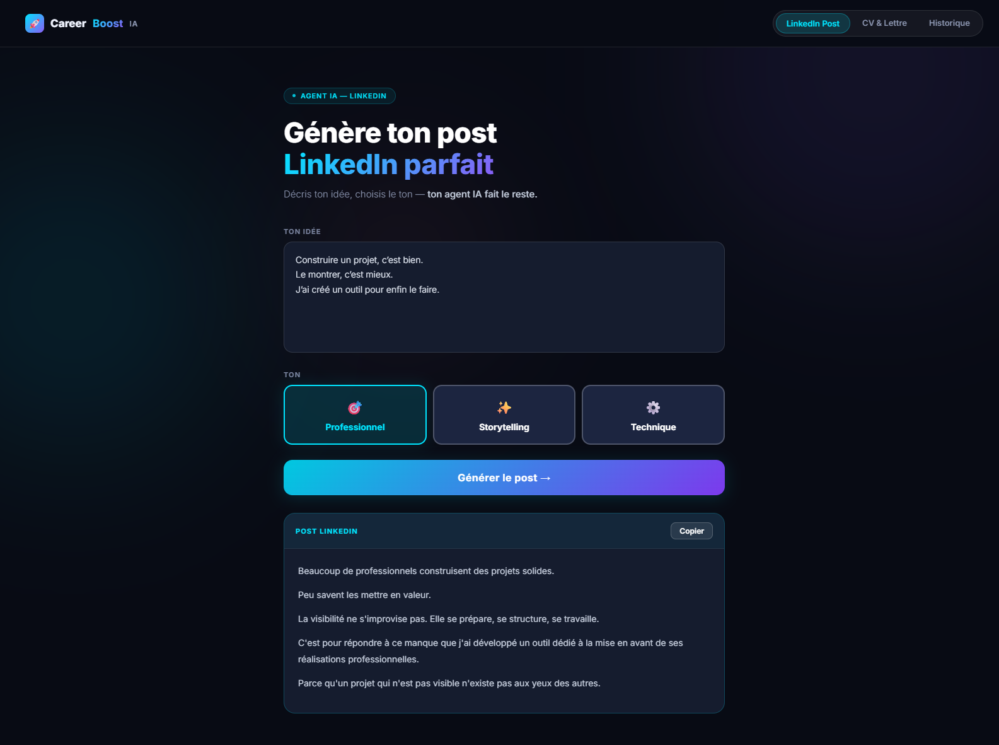

# CareerBoost IA

[](https://github.com/Cristina-MariaG/CarrerBoost/actions/workflows/ci.yml)

> Deux agents IA propulsés par Claude (Anthropic) pour booster ta recherche d'emploi.

---

## Agents

**Agent CV & Lettre de motivation** — Uploade ton CV en PDF et colle une offre d'emploi. L'agent adapte ton CV et ta lettre au poste visé, ou analyse ton profil et te donne un score d'adéquation /10 avec des recommandations concrètes.

**Agent LinkedIn** — Décris une expérience ou un projet. L'agent génère un post LinkedIn optimisé selon le ton choisi : professionnel, storytelling ou technique.

Les deux agents streamaient les réponses token par token via SSE — pas d'attente bloquante.



---

## Stack

| Couche | Technologie |
|--------|-------------|
| Backend | Python 3.13 · Django 5 · Django REST Framework |
| IA | Anthropic SDK · Claude Sonnet · streaming SSE · prompt caching |
| Frontend | Vue.js 3 · Vite · Vue Router |
| Base de données | PostgreSQL 16 |
| Infrastructure | Docker · docker-compose · Gunicorn |

---

## Démarrage rapide

**Prérequis :** Docker + une clé API Anthropic ([console.anthropic.com](https://console.anthropic.com))

```bash
# 1. Configurer l'environnement
cp .env.example .env
# Renseigner ANTHROPIC_API_KEY et DJANGO_SECRET_KEY dans .env

# 2. Lancer l'application
docker compose up --build

# 3. Vérifier que le backend répond
curl http://localhost:8000/api/health/
# → {"status": "ok"}
```

L'application est disponible sur **http://localhost:5173**

---

## Commandes utiles

```bash
# Tests backend
docker compose exec backend python manage.py test agents

# Lint backend (Flake8)
docker compose exec backend flake8 .

# Tests frontend
cd frontend && npm test

# Lint frontend (ESLint)
cd frontend && npm run lint

# Migrations
docker compose exec backend python manage.py migrate

# Logs
docker compose logs -f backend
docker compose logs -f frontend

# Réinitialiser complètement
docker compose down -v
```

---

## Architecture

```
backend/
├── config/              # Django settings, urls, wsgi
└── agents/
    ├── services/
    │   ├── claude_client.py   # Wrapper SDK Anthropic — streaming SSE, prompt caching
    │   ├── cv_agent.py        # Agent CV & LM — adaptation + analyse
    │   └── linkedin_agent.py  # Agent LinkedIn — 3 tons
    ├── models.py              # Session (UUID anonyme), GenerationHistory
    ├── serializers.py         # Validation des inputs (PDF magic bytes, choix de ton…)
    ├── views.py               # Endpoints DRF + StreamingHttpResponse
    └── tests/                 # 24 tests — claude_client, cv_agent, linkedin_agent

frontend/
├── src/
│   ├── services/api.js        # fetch SSE (streamCv, streamLinkedIn) + session UUID
│   ├── views/                 # LinkedinView, CvView (toggle Adapter/Analyser), HistoryView
│   ├── components/            # PostResult, ResultCard, AnalysisCard, FileUpload
│   └── tests/                 # Vitest — FileUpload, PostResult, api.js
```

### Flux de données

```
Vue (fetch) → POST /api/agents/cv/      (multipart : offre + PDF)
           → POST /api/agents/linkedin/ (JSON : description + ton)
  → Serializer (validation)
  → DRF view → agent service → claude_client (streaming Claude)
  → StreamingHttpResponse SSE → Vue affiche token par token
  → GenerationHistory sauvegardé en base
```

---

## Variables d'environnement

Voir `.env.example`. Variables obligatoires :

| Variable | Description |
|----------|-------------|
| `ANTHROPIC_API_KEY` | Clé API Anthropic |
| `DJANGO_SECRET_KEY` | Secret Django (min. 50 caractères aléatoires) |
| `POSTGRES_DB` / `POSTGRES_USER` / `POSTGRES_PASSWORD` | Credentials PostgreSQL |
